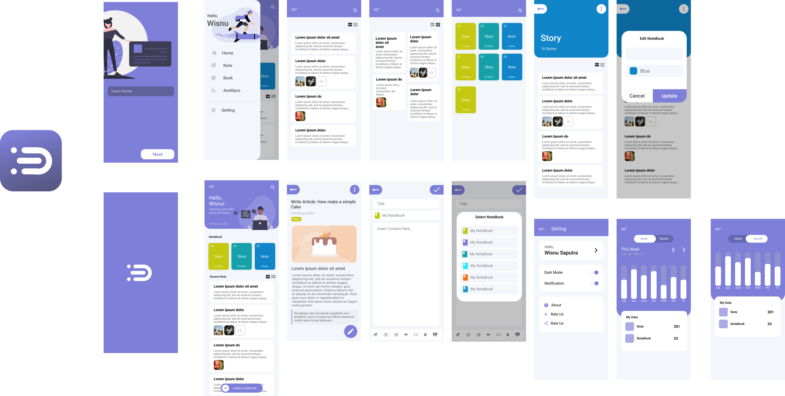

# catatin

A new Flutter project.

## Getting Started

This project is a starting point for a Flutter application.

A few resources to get you started if this is your first Flutter project:

- [Lab: Write your first Flutter app](https://flutter.dev/docs/get-started/codelab)
- [Cookbook: Useful Flutter samples](https://flutter.dev/docs/cookbook)

For help getting started with Flutter, view our
[online documentation](https://flutter.dev/docs), which offers tutorials,
samples, guidance on mobile development, and a full API reference.

This project implement Clean Architecture and TDD

# Note: Must Cleaning Code

Simply setup:

```bash
git clone git@git:wisnuwiry/CatatinApp.git
cd CatatinApp
code .
flutter pub get
flutter run
```

### Note: This project has not been Complete

If you want to see the mockup of this project, the link is below.

<iframe style="border: none;" width="800" height="450" src="https://www.figma.com/embed?embed_host=share&url=https%3A%2F%2Fwww.figma.com%2Ffile%2Fe6yjTOh1yKYWGM4iYKeSTr%2FCatatin%3Fnode-id%3D0%253A1" allowfullscreen></iframe>

